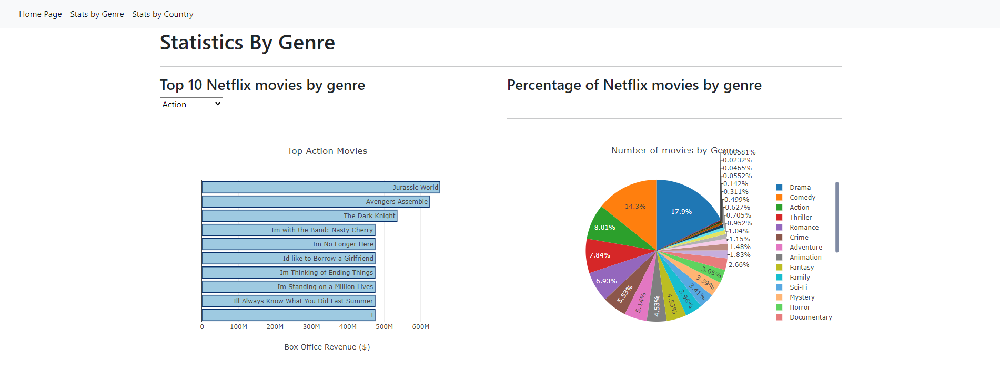
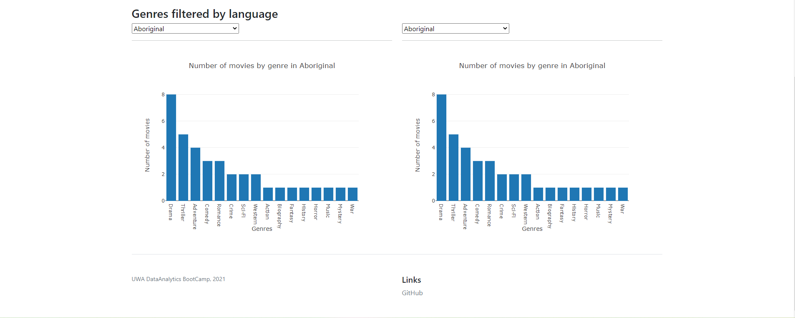

# Netflix is Cool

# Purpose and motivation

Movies are timeless, but not all are created equal.

The aim of this project is to allow users to analyse movies and shows available on Netflix. 

Users will be able to answer the following questions:
1. Has there been a change in the number of movies released over time?

2. What are the top 10 grossing movies within their favourite genre?

3. What genres are more popular around the world?

4. Does language impact genre preferences?

5. How many movies are available in each country in the world?

# Solution
We have created a flask app to render different pages to answer the above questions.

I have a demo app running on: [https://retail-challenge-lite.herokuapp.com/](https://retail-challenge-lite.herokuapp.com/)

Below are screenshots of what the app looks like when running:

### Index Page


[Plotly JS](https://plotly.com/javascript/) was used to render the data onto the page by querying the API endpoints created.

### Stats by Genre




Data is updated using an API we wrote using REST API.

### Stats by Country


This page was created using [Leaflet](https://leafletjs.com/).


# Running locally

1. Freeze pip / conda requirements

   ```
   python -m pip list --format=freeze > requirements.txt
   ```

2. Create the environment using

   ```
   conda create -n <env> --file requirements.txt
   ```

3. Run the app using:

   ```
   python app.py
   ```

   OR

   ```
   flask run
   ```

# Deploying to Heroku

1. Freeze pip / conda requirements

   ```
   python -m pip list --format=freeze > requirements.txt
   ```

2. Create/Update `Procfile` to use gunicorn to run the web server and set app.py as the application to run:

   ```
   web: gunicorn app:app
   ```

3. Create/Update `runtime.txt` to contain:

   ```
   python-3.7.10
   ```